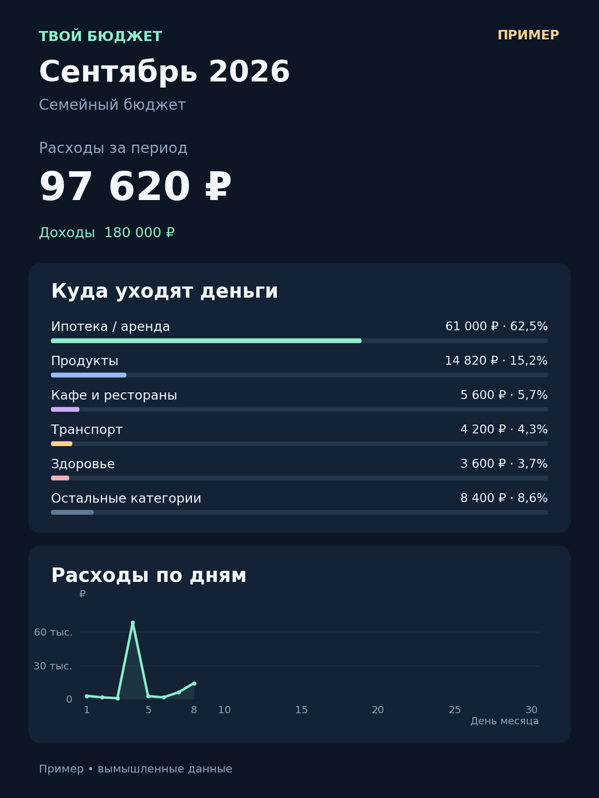

# Оформление бота

Имя: **Мой Финансовый Советник**. Username существующего бота сохраняется.

Короткое описание профиля:

> Личный и семейный бюджет: быстрый учёт, графики расходов и понятные подсказки.

Полное описание находится в `app/branding.py`. При запуске этой версии бот обновляет описание для русского языка и языка по умолчанию; ошибка обновления профиля не останавливает бюджет. В тексте честно указан текущий доступ по приглашению и отсутствие подключения к банковским счетам.

## Аватар

Изображение создано встроенной генерацией изображений. Исходный запрос: отдельный квадратный аватар для личного и семейного бюджета; простой мятный кошелёк с диаграммой расходов на тёмном фоне, без текста и чужих логотипов, с отступами для круглой обрезки Telegram. Это графический знак, цифр и реальных финансовых данных в нём нет.

Чтобы установить с телефона: откройте [BotFather](https://t.me/BotFather) → `/mybots` → `@my_finance_advisor_bot` → **Edit Bot → Edit Botpic** и отправьте `app/assets/avatar.png` изображением. Это действие меняет только аватар выбранного бота. Бот не пересылает аватар или объявления другим пользователям.

## Графики и подсказки

- «Аналитика» / `/analytics`: диаграмма категорий, траты по дням и сравнение расходов с прошлым месяцем за одинаковое число дней.
- `/charts`: только карточка графика. На ней подписаны месяц и личный/семейный бюджет.
- `/tips` или кнопка под графиком: до четырёх подсказок с суммами, лимитами и объяснением расчёта.
- Кнопки под изображением сохраняют месяц карточки. После переключения личного/семейного бюджета старую кнопку нужно открыть заново.
- Графики формируются на сервере в PNG. Финансовые данные не отправляются внешней нейросети или сервису диаграмм. Картинка доставляется пользователю через Telegram, как обычный отчёт бота.
- «Остальные категории» включает все расходы вне пяти крупнейших категорий. Дни без записей не подтверждают отсутствие трат, а будущие дни не отображаются как нулевые.
- Если данных недостаточно, бот предлагает заполнить учёт. Снижение трат само по себе не считается улучшением; автоматических советов урезать здоровье, жильё или необходимые платежи нет.

Обычный чат использует возможности Telegram: аватар, описание, текст, кнопки и изображения. Для интерактивных диаграмм и произвольного расположения элементов потребуется отдельный Mini App: [документация Telegram](https://core.telegram.org/bots/webapps).

## Публикация этой версии

Изменений схемы базы и доступа пользователей в этом обновлении нет. Добавляется зависимость Matplotlib; обычная сборка устанавливает её из `requirements.txt`. Применяется существующая процедура резервной копии и обновления из README. После запуска проверить `/start`, `/analytics`, `/tips`, выбор прошлого месяца и переключение семейного бюджета в личном чате.

Выход к новым пользователям описан в [PUBLIC_ROADMAP.md](PUBLIC_ROADMAP.md). Подготовка визуального обновления сама по себе не открывает регистрацию.
